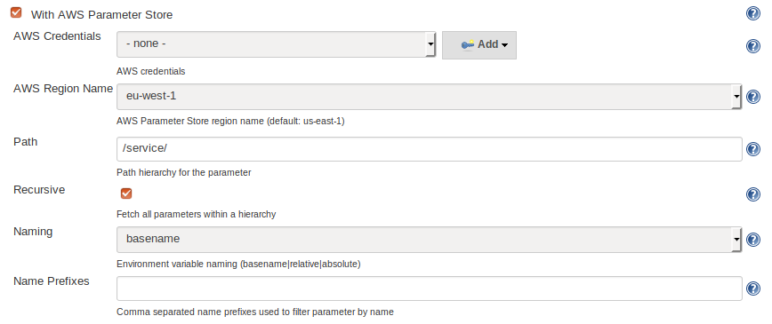

# aws-parameter-store-plugin
A Jenkins plugin to populate environment variables from [AWS Parameter Store](https://docs.aws.amazon.com/systems-manager/latest/userguide/systems-manager-paramstore.html).

## Overview
This plugin collects parameters from the AWS Parameter Store and sets them as environment variables for a build.

Each AWS Parameter Store parameter name is converted to uppercase and any non-numeric characters are converted to underscores. For example, the parameter name `my-param1` with value `my-value1` would become the environment variable `MY_PARAM1=my-value1`.

This plugin is compatible with [AWS Parameter Store Hierarchies](https://docs.aws.amazon.com/systems-manager/latest/userguide/sysman-paramstore-working.html). A **path** and **recursive** indicator can be specified to pass to the [GetParametersByPath](https://docs.aws.amazon.com/systems-manager/latest/APIReference/API_GetParametersByPath.html) API call. The **naming** parameter can be used to specify how the environment variable is derived from the **path**:

  * **basename** - anything after the last '/' is the variable name (e.g. with path `/service`, parameter `/service/app/param` becomes `PARAM`)
  * **relative** - anything after the **path** is the variable name (e.g. with path `/service`, parameter `/service/app/param` becomes `APP_PARAM`)
  * **absolute** - the full path with parameter name is the variable name (e.g. with path `/service`, parameter `/service/app/param` becomes `SERVICE_APP_PARAM`)

Parameter types are handled as follow:

  * **String** parameter values are unchanged
  * **SecureString** parameter values are decrypted
  * **StringList** parameter values are set as comma-separated values

## Configuration

The plugin is configured on each build configuration page:

This has the following fields:

  * **AWS Credentials** - the id of credentials added via the [AWS Credentials Plugin](https://plugins.jenkins.io/aws-credentials)
  * **AWS Region Name** - the region name to search for parameters (defaults to `us-east-1`)
  * **Path** - the hierarchy for the parameters
  * **Recursive** - whether to retrieve all parameters within a hierarchy
  * **Naming** - whether the environment variable should be **basename**, **relative** or **absolute**
  * **Name Prefixes** - Filter parameters by comma separated name prefixes

## Pipelines

This plugin can be included in your `Jenkinsfile`, for example:

    withAWSParameterStore(credentialsId: '', naming: 'relative', path: '/service', recursive: true, regionName: 'eu-west-1') {
      // some block
    }

## Authentication

The plugin is authenticated by:

  * Using the specified Jenkins credentials (created at either global or folder level)
  * For empty Jenkins credentials, using the AWS_ACCESS_KEY_ID and AWS_SECRET_ACCESS_KEY (and AWS_SESSION_TOKEN) from the **build environment**
  * For empty Jenkins credentials and no AWS_* environment variables, using the [default credentials provider chain](https://docs.aws.amazon.com/AWSJavaSDK/latest/javadoc/com/amazonaws/auth/DefaultAWSCredentialsProviderChain.html) on the **Jenkins master**

Jenkins plugins run on the master node, so it is not possible to assume the IAM role of a slave node when a job is executed.
However, for **pipelines** it should be possible to fetch those credentials and set the appropriate environment variables.
